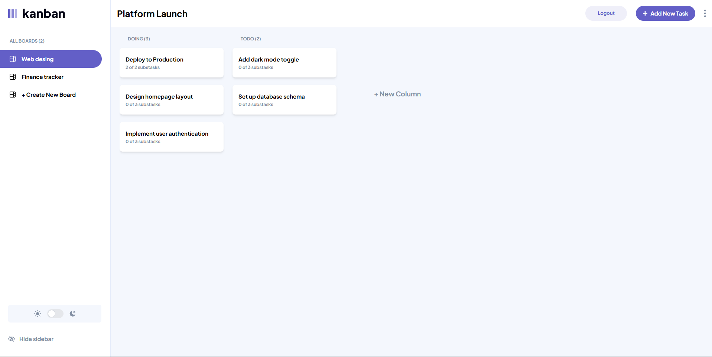

# About project

Hi. This is the frontend for the Kaban task management application from [Frontend Mentor](https://www.frontendmentor.io/challenges/kanban-task-management-web-app-wgQLt-HlbB). The project is built using React, and it uses the [node backend](https://github.com/Jayslen/Kanban-task-management-backend) build with Express.js saving the data in a MySQL database.

It has a extra feature that i added, which allow the user to register and login, so each user can have their own boards.

<div style="display: flex; gap: 10px; flex-wrap: wrap; justify-content: center; align-items: center;">
    
    
</div>

## Features
- CRUD operations for boards, columns and tasks.
- Light and dark mode.
- Local mode to save data in the browser's local storage.
- Responsive design for mobile, tablet and desktop.
- Authentication system with registration and login.

## Technologies used
- TypeScript
- React
- React Router
- Tailwind CSS
- Zustand
- just-debounce-it
- react-hot-toast

## How to run the project
1. Clone the repository:
   ```bash
   git clone https://github.com/Jayslen/Kanban-task-management-frontend
   ```
2. Navigate to the project directory:
   ```bash
    cd Kanban-task-management-frontend
    ```
3. Install the dependencies:
    ```bash
    npm install
    ```
4. Start the development server:
    ```bash
    npm start
    ```